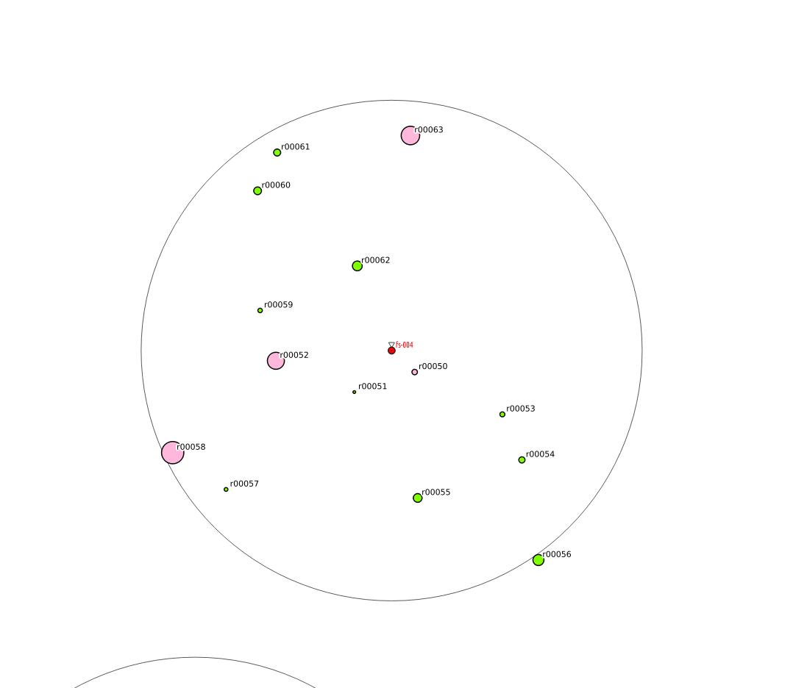
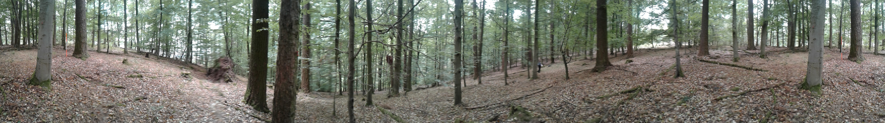

# Survey Plots

### Forest Structure -- fs
Plots for surveying forest structure are setup by various student groups since 2017. The decision where to set up a plot follows no random or systematic scheme (what a pitty!) but is somehow accidental.

General characteristics are:
* circular 10m radius in horizontal plane
* slope
* aspect
* remarks on special items

All plots are marked with a central point (stored in `topopoint` (see figure \@ref(fig:benchmark-fig)).

```{r benchmark-fig, echo=FALSE, fig.align='center', fig.cap='Benchmark', fig.alt='Benchmark'}
knitr::include_graphics("images/benchmark.png")
```

On the plot following items are surveyed depending on time:
* coordinates of all trees from 7 cm dbh
* species
* dbh
* optional
  * height
  * micro habitats
  * vitality
  * social position
  
A plot from data out of MOFgeoDB is shown in figure \@ref(fig:fs-plot-fig).

```{r fs-plot-fig, echo=FALSE, fig.align='center', fig.cap='fs-004 as example for the visualization of the plot data in QGIS.', fig.alt='Example of fs-plot'}

```
In real the plot looks something like this:
```{r fs-004-summerPano-fig, echo=FALSE, fig.align='center', fig.cap='Panoramic view of fs-004 in summer.', fig.alt='SUmmer pano of fs-004'}

```


All plots are visited sporadically. The locations are shown in figure XXX